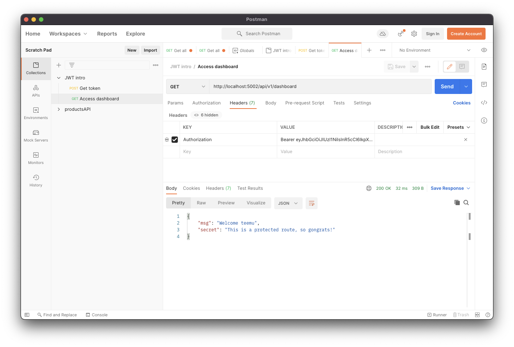

# Exercise set 01

Example documentation file for the exercise set 01. This file should be updated with the completion of each task in the set and the link for this documentation should be submitted to Moodle.

**Use image links to include screenshots of your solutions.**

**The completion of each task (e.g. a request/response from an API client, console messages, screens from database admin software) should be made visible using screeshots.** 

## Task 1

Add documentation for the completion of Task 1 here.

Add images to the [`screenshots` folder](screenshots) for each exercise set and link them in this markdown file. Use the following markdown syntax to include images in this document:

```markdown

```

The markdown above will include the image `Postman_access_granted.png` from the `screenshots` folder:


## Task 2

Add documentation for the completion of Task 2 here.

You can also use code blocks to include code snippets in the documentation:

```javascript
console.log('Hello, world!');
```

## and so on...