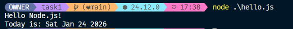
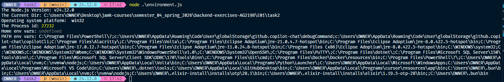
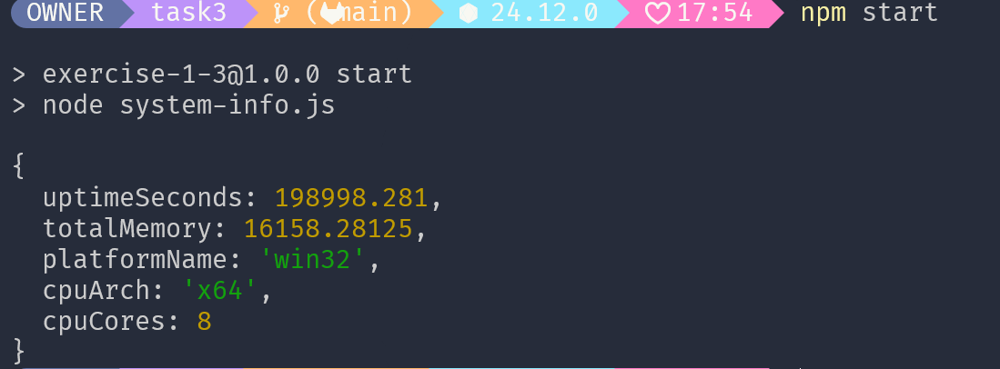
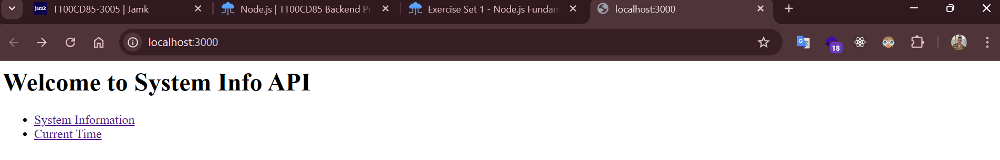
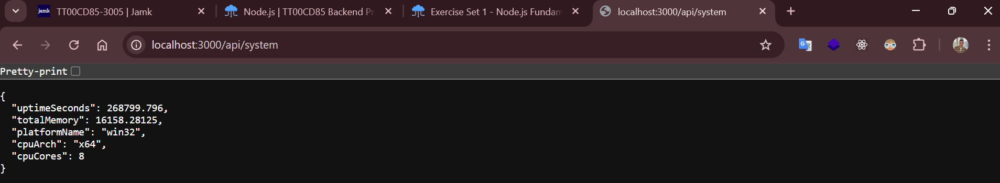
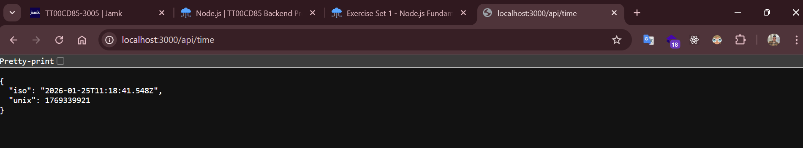

# Exercise set 01

## Task 1



```js
console.log("Hello Node.js!");
console.log("Today is:", new Date().toDateString());
```

---

## Task 2



```js
console.log("The Node.js Version:", process.version);
console.log(`The Current Dir: ${process.cwd()}`);
console.log("Operating system platform: ", process.platform);
console.log("The Process id:", process.pid);
console.log("Home env vars:", process.env.HOME);
console.log("PATH env vars:", process.env.PATH);
```

---

## Task 3



```js
import os from "os";

function getSystemInfo() {
  return {
    uptimeSeconds: os.uptime(),
    totalMemory: os.totalmem() / 1024 ** 2,
    platformName: os.platform(),
    cpuArch: os.arch(),
    cpuCores: os.cpus().length,
  };
}

const info = getSystemInfo();

console.log(info);
```

---

## Task 4


```js
import { writeFile, readFile } from "fs/promises";

const fileName = "output.txt";

const content = `My name is LazyBee and today is ${new Date().toLocaleDateString()} and current time is ${new Date().toLocaleString()}`;

writeFile(fileName, content);

async function main() {
  try {
    await writeFile(fileName, content);
    console.log(`Content wrote to ${fileName}`);

    const outputContent = await readFile(fileName, "utf-8");
    console.log(`Content read from ${fileName}`);
    console.log(outputContent);
  } catch (error) {
    console.log(error);
  }
}

main();
```

## Task 5

**system-utils.js**

```js
import os from "os";

export async function getSystemInfo() {
  return {
    uptimeSeconds: os.uptime(),
    totalMemory: os.totalmem() / 1024 ** 2,
    platformName: os.platform(),
    cpuArch: os.arch(),
    cpuCores: os.cpus().length,
  };
}
```

**server.js**





```js
import http from "http";
import { getSystemInfo } from "./system-utils.js";

const PORT = 3000;

const server = http.createServer(async (req, res) => {
  const url = req.url;

  if (url === "/api/system") {
    const osInfo = await getSystemInfo();
    res.writeHead(200, { "content-type": "application/json" });
    res.end(JSON.stringify(osInfo, null, 2));
  } else if (url === "/api/time") {
    const now = new Date();

    const timeData = {
      iso: now.toISOString(),
      unix: Math.floor(now.getTime() / 1000),
    };

    res.writeHead(200, { "content-type": "application/json" });

    res.end(JSON.stringify(timeData, null, 2));
  } else if (url === "/") {
    res.writeHead(200, { "content-type": "text/html" });

    res.end(`
      <h1>Welcome to System Info API</h1>
      <ul>
        <li><a href="/api/system">System Information</a></li>
        <li><a href="/api/time">Current Time</a></li>
      </ul>
    `);
  } else {
    res.writeHead(404, { "Content-Type": "text/plain" });

    res.end("404! PAGE NOT FOUND");
  }
});

server.listen(PORT);
```
