# Exercise set 02

# Task 1

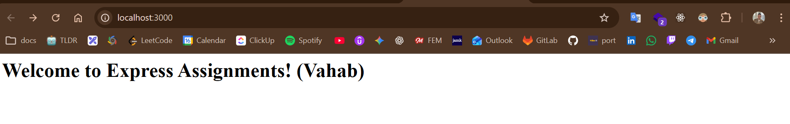
---
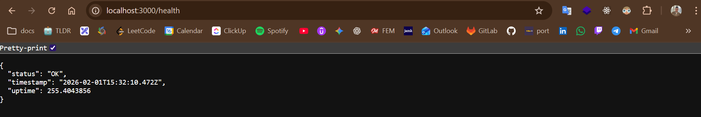

 ```js
//  package.json
{
  "type": "module",
  "name": "express-basics",
  "scripts": {
    "start": "node app.js",
    "dev": "node --watch app.js"
  },
  "dependencies": {
    "express": "^5.2.1"
  }
}

 ```


```js
// app.js
import express from "express";

const app = express();
const PORT = 3000;

app.get("/", (req, res) => {
  res.send("<h1>Welcome to Express Assignments! (Vahab)</h1>");
});

app.get("/health", (req, res) => {
  res.json({
    status: "OK",
    timestamp: new Date().toISOString(),
    uptime: process.uptime(),
  });
});

app.listen(PORT, () => {
  console.log(`Server running at http://localhost:${PORT}`);
});

```
# Task 2

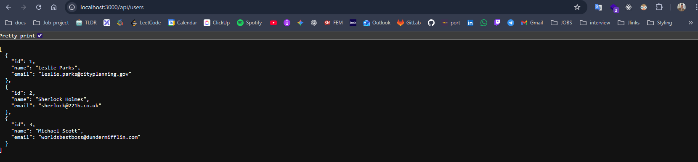
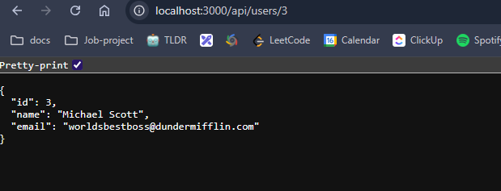
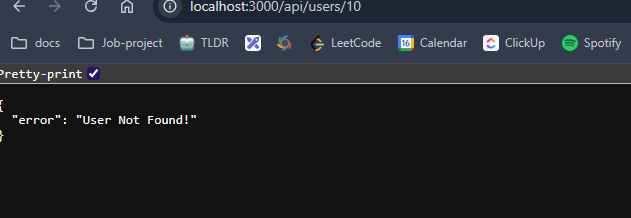
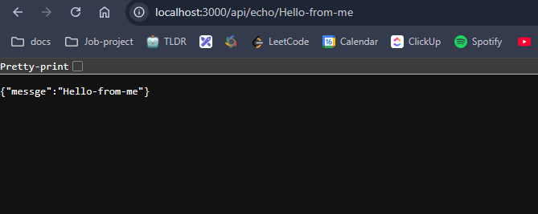
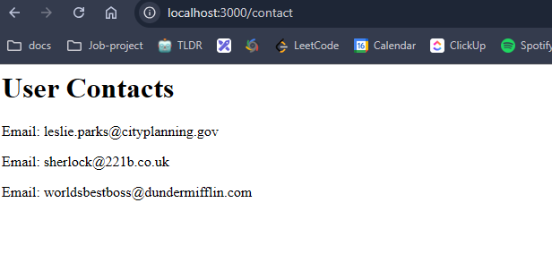


```js
// app.js
import express, { json } from "express";

const app = express();
const PORT = 3000;

const users = [
  { id: 1, name: "Leslie Parks", email: "leslie.parks@cityplanning.gov" },
  { id: 2, name: "Sherlock Holmes", email: "sherlock@221b.co.uk" },
  { id: 3, name: "Michael Scott", email: "worldsbestboss@dundermifflin.com" },
];

app.get("/", (req, res) => {
  res.send(`<div><h1>Welcome to Express Assignments! (LazyBee)</h1>
     <ul>
        <li><a href="/api/users">Users</a></li>
      </ul>
      </div>
    `);
});

app.get("/api/users", (req, res) => {
  res.json(users);
});

app.get("/api/users/:id", (req, res) => {
  const { id } = req.params;
  const user = users.find((user) => user.id === +id);
  if (!user) {
    return res.status(404).json({ error: "User Not Found!" });
  }
  res.json(user);
});

app.get("/api/echo/:message", (req, res) => {
  const { message } = req.params;
  res.json({ messge: message });
});

app.get("/contact", (req, res) => {
  res.send(`
    <h1>User Contacts</h1>
    ${users.map((user) => `<p>Email: ${user.email}</p>`).join("")}
  `);
});

app.listen(PORT, () => {
  console.log(`Server running at http://localhost:${PORT}`);
});


```

# Task 3

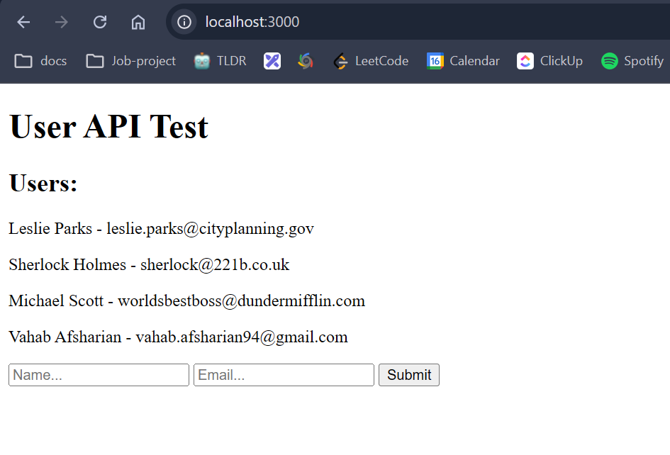
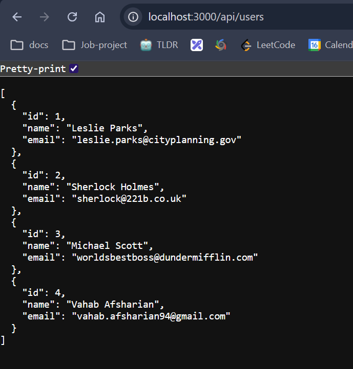


```html
<!doctype html>
<html>
  <head>
    <title>Express API Test</title>
  </head>
  <body>
    <h1>User API Test</h1>
    <div id="users"></div>

    <form id="user-form">
      <input type="text" id="name" placeholder="Name..." />
      <input type="text" id="email" placeholder="Email..." />
      <button>Submit</button>
    </form>

    <script>
      async function fetchUsers() {
        try {
          const response = await fetch("/api/users");
          const users = await response.json();
          document.getElementById("users").innerHTML = "<h2>Users:</h2>" + users.map((u) => `<p>${u.name} - ${u.email}</p>`).join("");
        } catch (error) {
          console.error("Error:", error);
        }
      }

      const form = document.getElementById("user-form");

      form.addEventListener("submit", async (event) => {
        event.preventDefault();

        const name = document.getElementById("name").value;
        const email = document.getElementById("email").value;

        const response = await fetch("/api/users", {
          method: "POST",
          headers: { "Content-Type": "application/json" },
          body: JSON.stringify({
            name: name,
            email: email,
          }),
        });

        if (response.ok) {
          fetchUsers();
          form.reset();
        }
      });

      fetchUsers();
    </script>
  </body>
</html>

```


```js
// app.js

import express from "express";

const app = express();
const PORT = 3000;

app.use(express.json());
app.use(express.static("public"));

const users = [
  { id: 1, name: "Leslie Parks", email: "leslie.parks@cityplanning.gov" },
  { id: 2, name: "Sherlock Holmes", email: "sherlock@221b.co.uk" },
  { id: 3, name: "Michael Scott", email: "worldsbestboss@dundermifflin.com" },
];

app.get("/api/users", (req, res) => {
  res.json(users);
});

app.post("/api/users", (req, res) => {
  const { name, email } = req.body;

  if (!name || !email) {
    return res.status(400).json({ error: "Name and email are required" });
  }

  const newUser = {
    id: Math.max(...users.map((u) => u.id)) + 1,
    name,
    email,
  };

  users.push(newUser);
  res.status(201).json(newUser);
});

app.listen(PORT, () => {
  console.log(`Server running at http://localhost:${PORT}`);
});

```

# Task 4

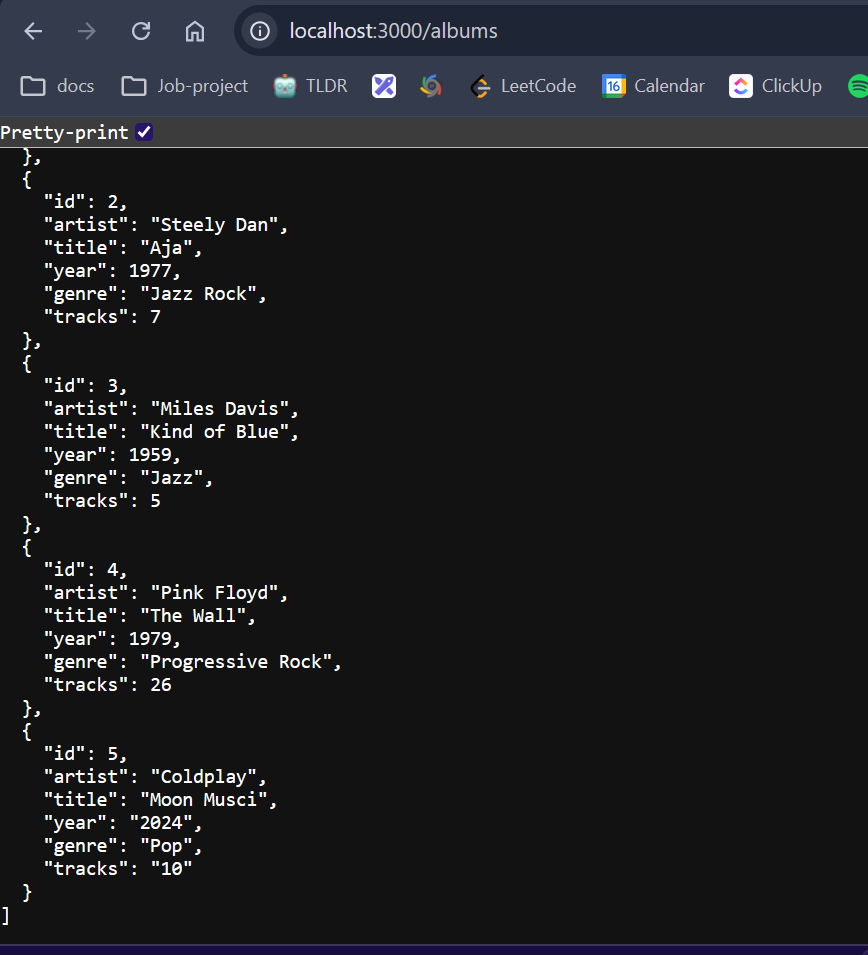


```js
import fs from "fs/promises";
import express from "express";

const app = express();
const PORT = 3000;

app.use(express.json());
app.use(express.static("public"));

async function loadAlbums() {
  const data = await fs.readFile("./data/albums.json", "utf8");
  return JSON.parse(data).albums;
}

async function saveAlbum(albums) {
  await fs.writeFile("./data/albums.json", JSON.stringify({ albums }, null, 2));
}

app.get("/albums", async (req, res) => {
  try {
    const albums = await loadAlbums();
    res.json(albums);
  } catch (error) {
    res.status(500).json({ error: "Failed to load albums" });
  }
});

app.get("/albums/:id", async (req, res) => {
  try {
    const { id } = req.params;
    const albums = await loadAlbums();
    const album = albums.find((a) => a.id === +id);

    if (!album) {
      return res.status(404).json({ error: "Album not found" });
    }

    res.json(album);
  } catch (err) {
    res.status(500).json({ error: "Failed to load The album" });
  }
});

app.post("/albums", async (req, res) => {
  try {
    const { artist, title, year, genre, tracks } = req.body;
    const albums = await loadAlbums();

    if (!artist || !title || !year || !genre || !tracks) {
      return res.status(400).json({ error: "All Fields are required" });
    }

    const newAlbum = {
      id: Math.max(...albums.map((u) => u.id)) + 1,
      artist,
      title,
      year,
      genre,
      tracks,
    };

    albums.push(newAlbum);
    await saveAlbum(albums);
    res.status(201).json({ message: "Album Saved", album: newAlbum });
  } catch (erro) {
    res.status(500).json({ error: "Failed to save album" });
  }
});

app.put("/albums/:id", async (req, res) => {
  try {
    const { id } = req.params;
    const { artist, title, year, genre, tracks } = req.body;
    const albums = await loadAlbums();

    const albumIdx = albums.findIndex((album) => album.id === +id);

    if (albumIdx === -1) {
      return res.status(404).json({ success: false, message: "Album Not Found!" });
    }

    albums[albumIdx] = {
      ...albums[albumIdx],
      artist,
      title,
      year,
      genre,
      tracks,
      id: +id,
    };

    await saveAlbum(albums);
    res.status(200).json({ data: albums[albumIdx] });
  } catch (error) {
    console.log(error);
    res.status(500).json({ error: "Failed to update album" });
  }
});

app.delete("/albums/:id", async (req, res) => {
  try {
    const { id } = req.params;
    const albums = await loadAlbums();

    const album = albums.find((a) => a.id === +id);

    if (!album) {
      return res.status(404).json({ success: false, message: "Album Not Found!" });
    }

    const newAlbums = albums.filter((album) => album.id !== Number(id));
    albums.splice(0, albums.length, ...newAlbums);
    res.status(204).json({ success: true });
  } catch (error) {
    res.status(500).json({ error: "Failed to Delete the album!" });
  }
});

app.listen(PORT, () => {
  console.log(`Server running on ${PORT}`);
});
```

# Task 5

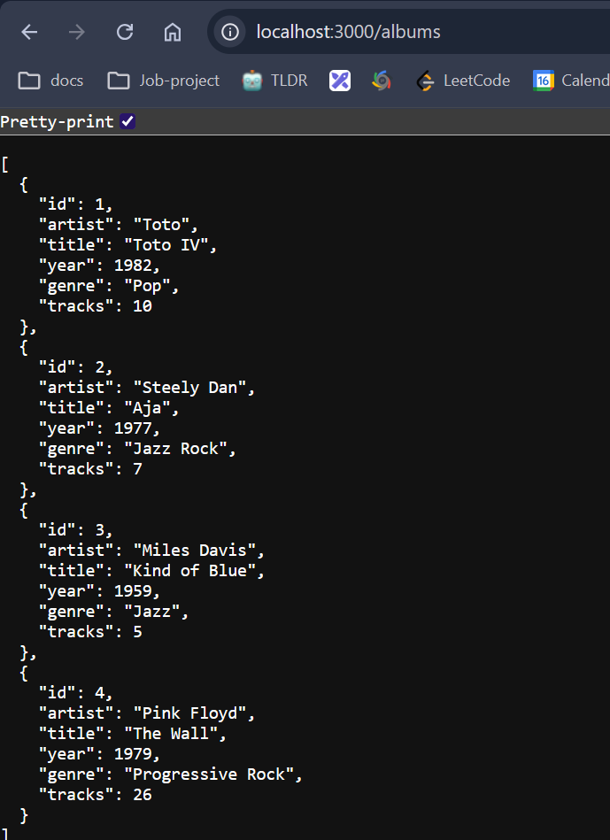
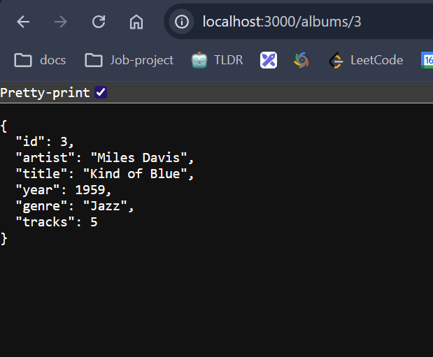
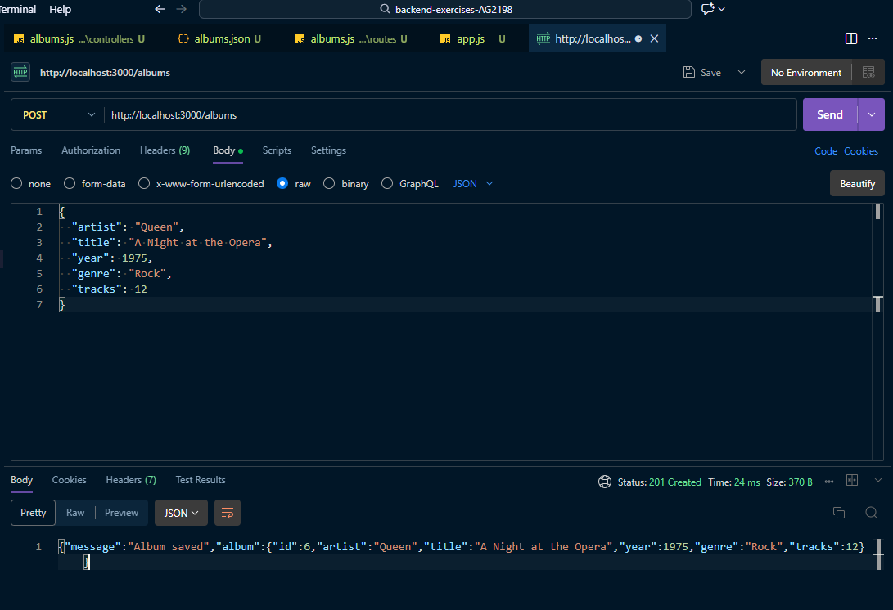
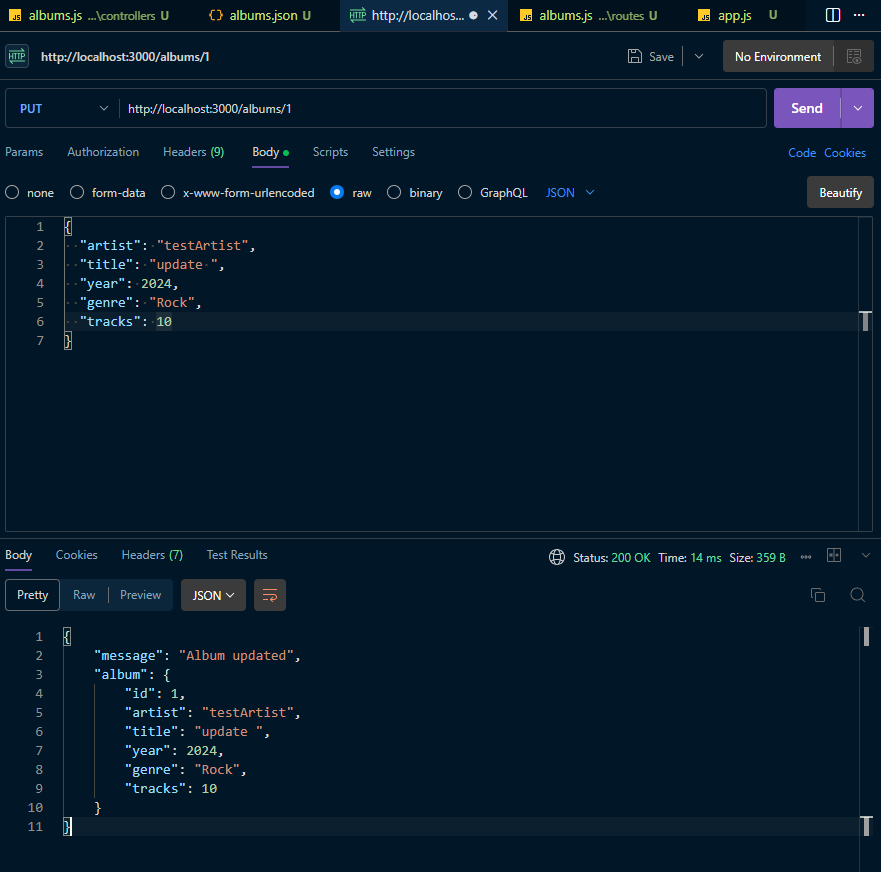

## Delete Request

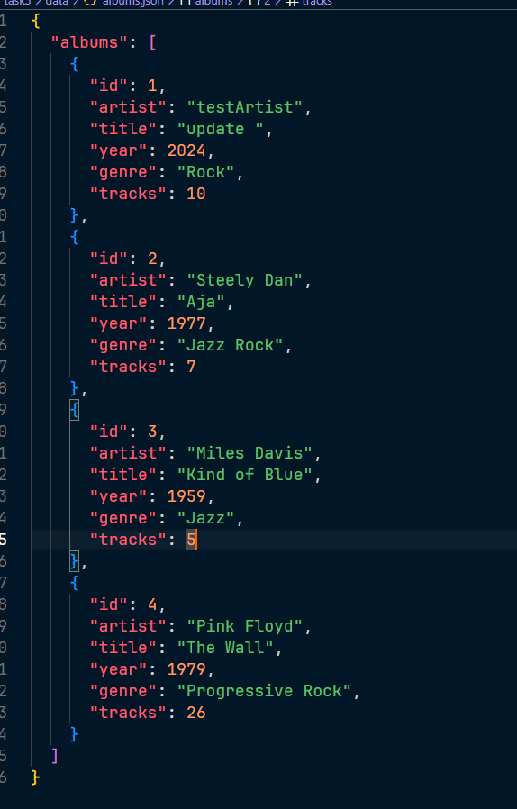
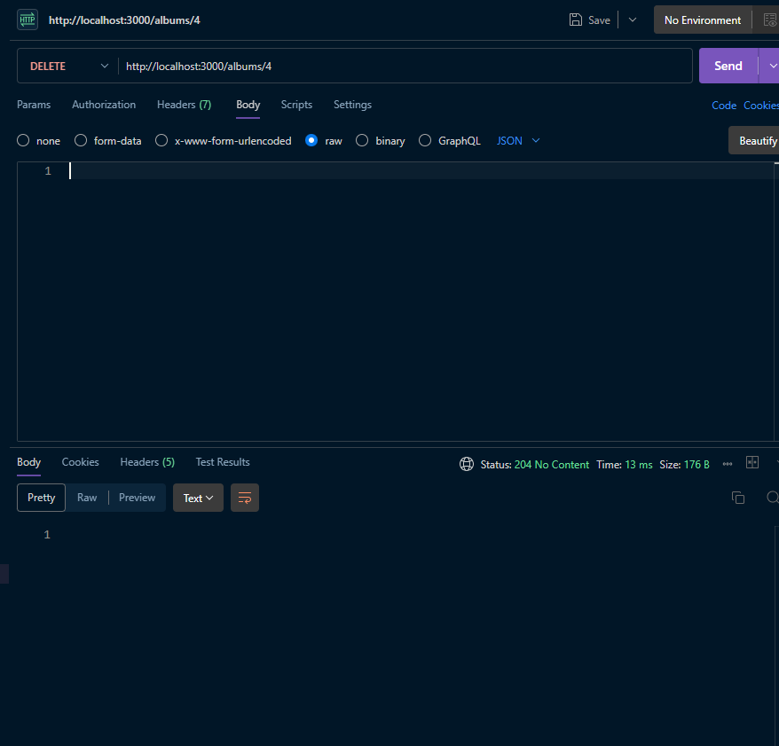
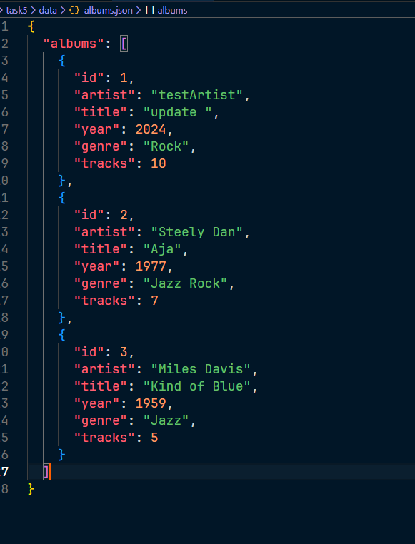

# Task 6

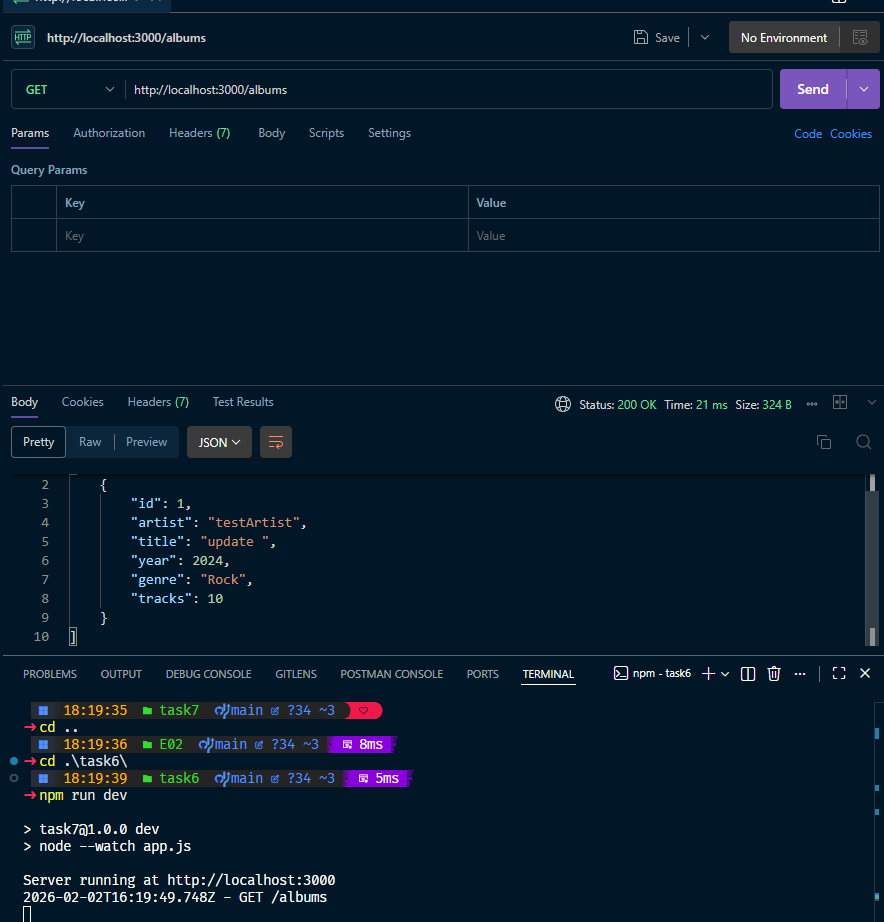
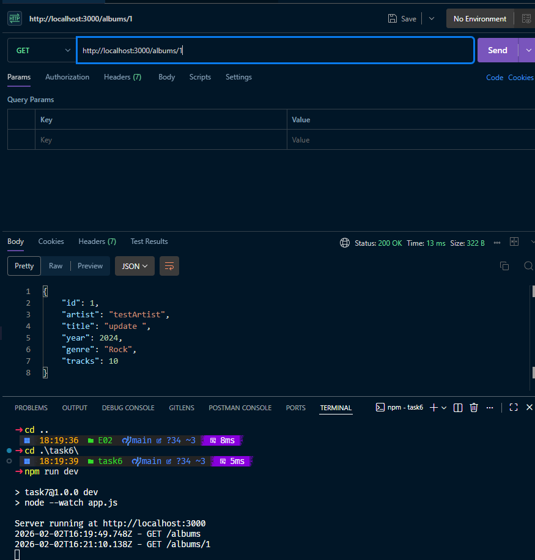
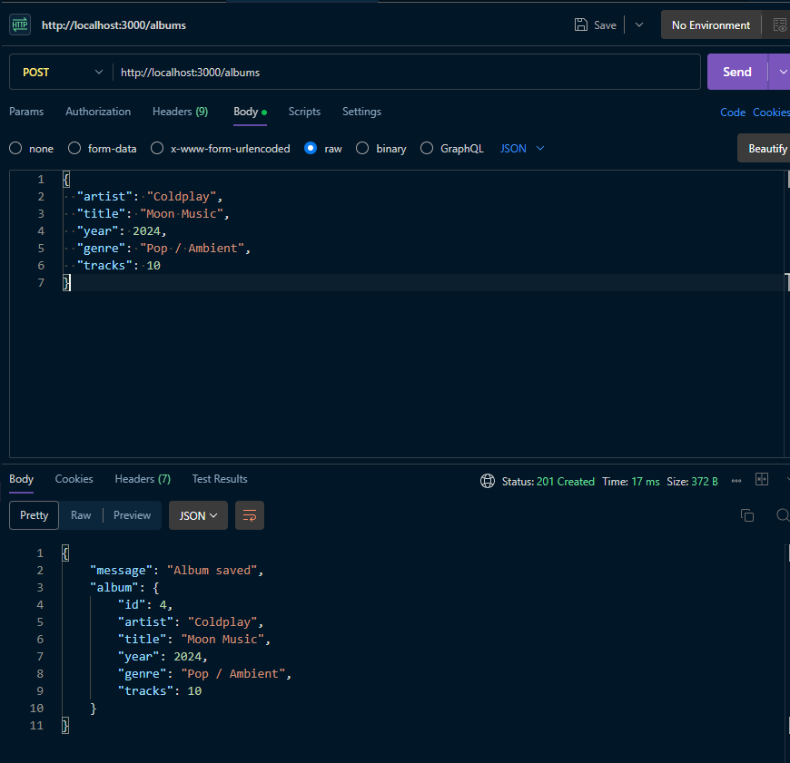
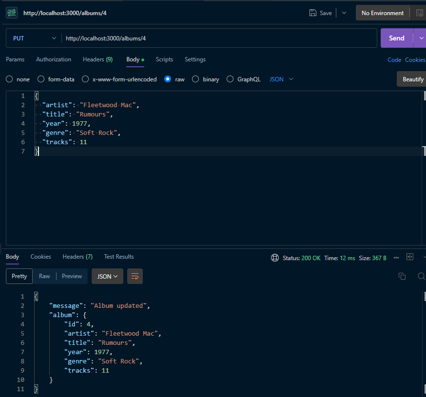
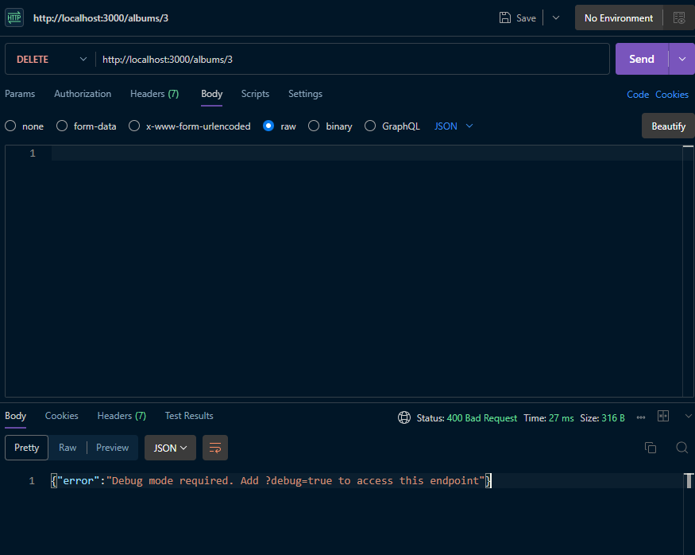
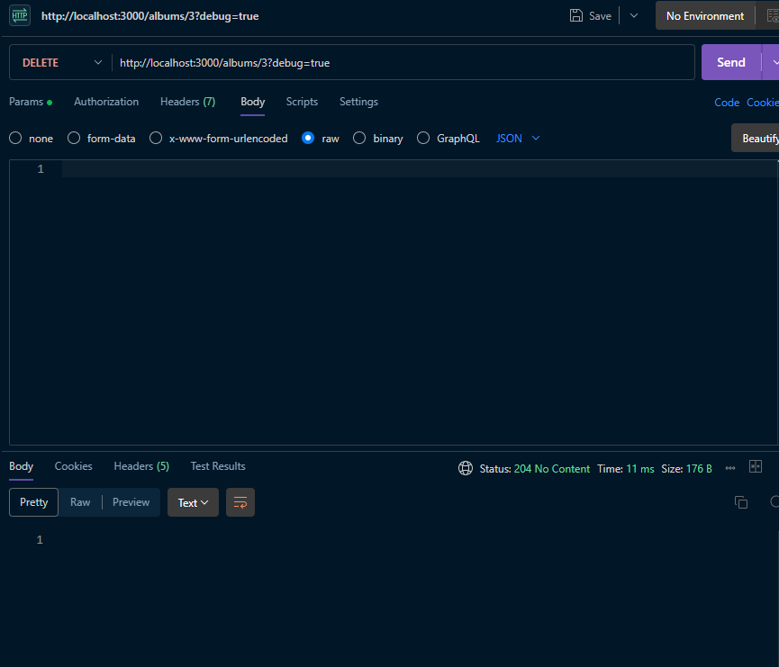

# Task 7

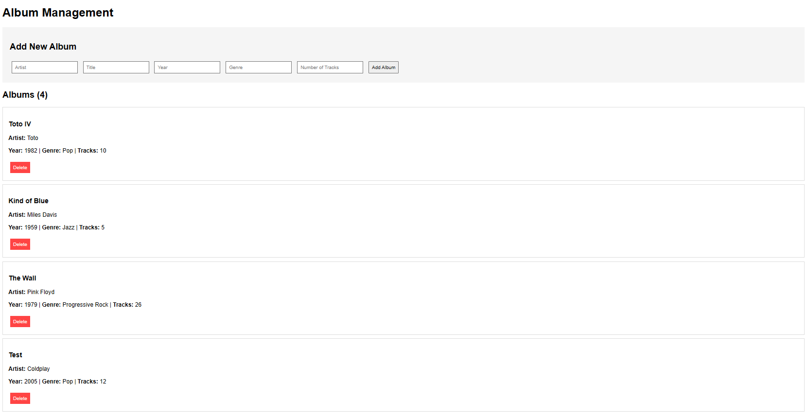
