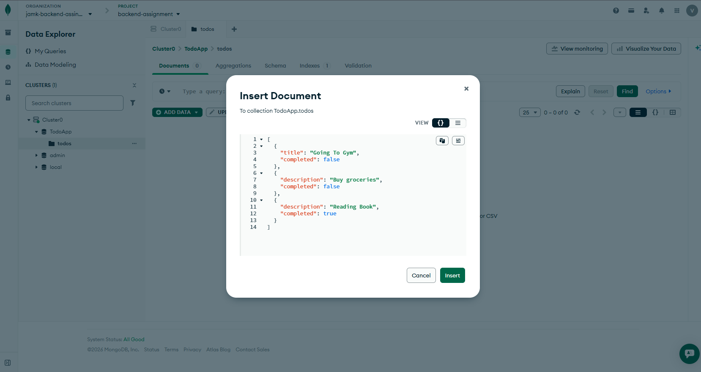
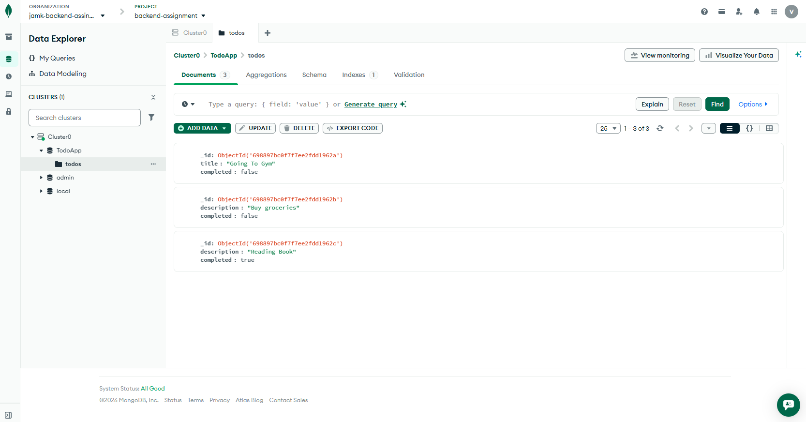
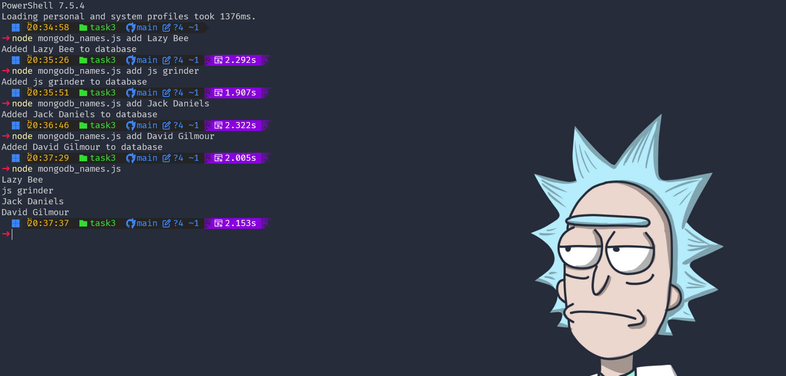
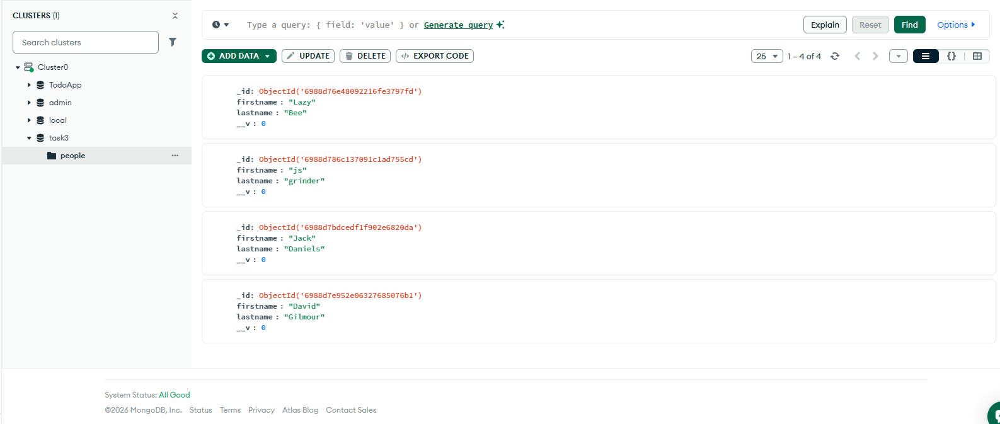
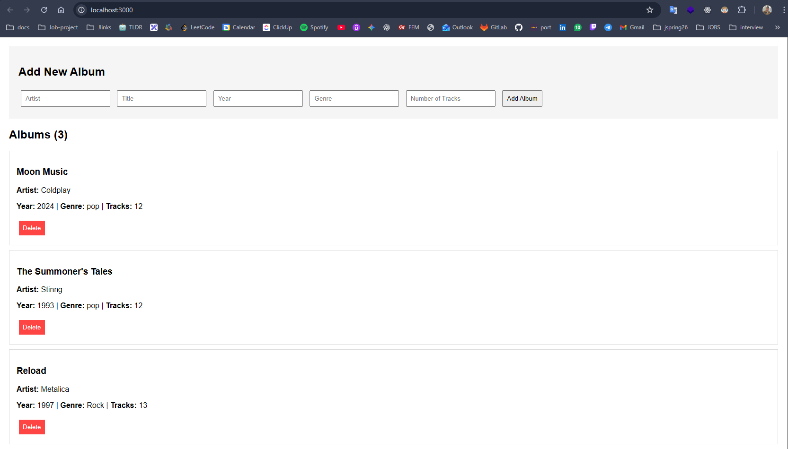
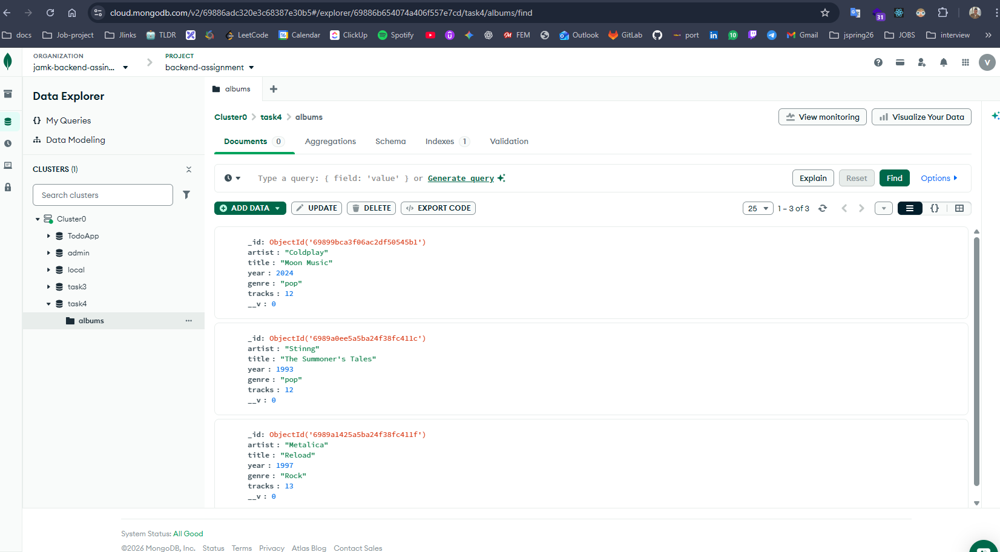
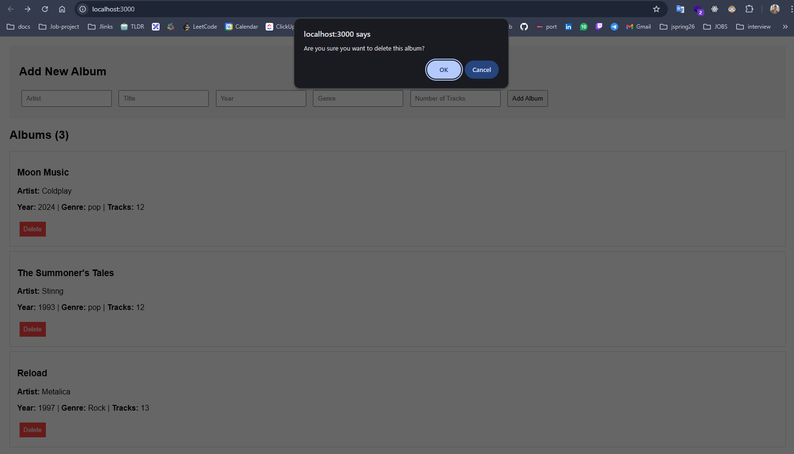
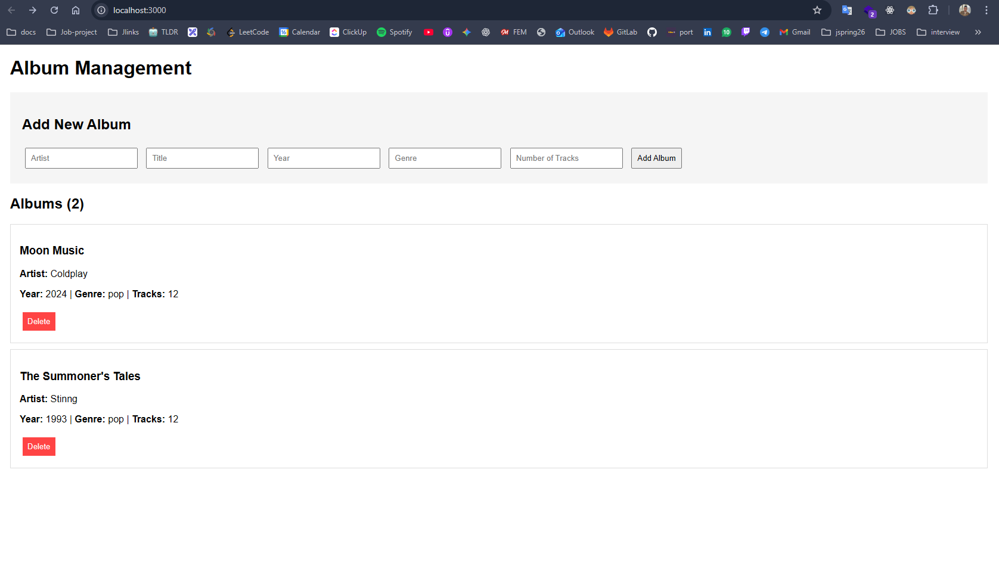

# Exercise set 03

## Task 1


## Task 2




## Task 3




```js
// Person.js

import { model, Schema } from "mongoose";

const personSchema = new Schema({
  firstname: String,
  lastname: String,
});

export default model("person", personSchema);


```

```js
// mongoosedb_names.js

import "dotenv/config";
import mongoose from "mongoose";
import yargs from "yargs";
import { hideBin } from "yargs/helpers";
import Person from "./models/Person.js";

const argv = yargs(hideBin(process.argv)).command("add <firstname> <lastname>", "Add a new name").help().argv;

try {
  await mongoose.connect(process.env.MONGO_URI);

  if (argv._.length === 0) {
    const persons = await Person.find({});
    for (const person of persons) {
      console.log(`${person.firstname} ${person.lastname}`);
    }
  } else {
    // Add new name
    const firstname = argv.firstname;
    const lastname = argv.lastname;

    const enteredPerson = new Person({
      firstname: firstname,
      lastname: lastname,
    });

    await enteredPerson.save();

    console.log(`Added ${firstname} ${lastname} to database`);
  }
} catch (error) {
  console.error("Error:", error.message);
} finally {
  await mongoose.connection.close();
}

```

## Task 4







```js
// app.js
import "dotenv/config";
import express from "express";
import albumRoutes from "./routes/albums.js";
import connectMongoDB from "./db/mongodb.js";

const app = express();

const requestLogger = (req, res, next) => {
  const timestamp = new Date().toISOString();
  console.log(`${timestamp} - ${req.method} ${req.url}`);
  next();
};

app.use(requestLogger);
app.use(express.json());
app.use(express.static("public"));
app.use("/albums", albumRoutes);

const PORT = 3000;

try {
  await connectMongoDB(process.env.MONGO_URI);
  app.listen(PORT, () => console.log(`Server listening on http://localhost:${PORT}`));
} catch (error) {
  console.log(error);
}

```


```js
// mongodb.js
import mongoose from "mongoose";

mongoose.set("debug", true);

const connectMongoDB = (url) => {
  return mongoose.connect(url);
};

export default connectMongoDB;
```

```js
//albums.js

import Album from "../models/Album.js";

export async function getAllAlbums(req, res) {
  // Implementation here
  try {
    const albums = await Album.find({}).exec();
    res.json(albums);
  } catch (error) {
    res.status(500).json({ error: "Failed To Load Album!" });
  }
}

export async function getAlbumById(req, res) {
  // Implementation here

  try {
    const { id } = req.params;
    const album = await Album.findById(id).exec();

    if (!album) {
      return res.status(404).json({ error: "Album not Found!" });
    }
    res.status(200).json(album);
  } catch (error) {
    res.status(500).json({ error: "Failed To Load the Album!" });
  }
}

export async function createAlbum(req, res) {
  // Implementation here
  try {
    const { artist, title, year, genre, tracks } = req.body;

    if (!artist || !title || !year || !genre || !tracks) {
      return res.status(400).json({ error: "All fields are required" });
    }

    const newAlbum = await Album.create({
      artist,
      title,
      year,
      genre,
      tracks,
    });

    res.status(201).json({ message: "Album saved", album: newAlbum });
  } catch (error) {
    console.log(error);
    res.status(500).json({ error: "Failed to save album" });
  }
}

export async function updateAlbum(req, res) {
  // Implementation here
  try {
    const { id } = req.params;
    const { artist, title, year, genre, tracks } = req.body;

    const updatedAlbum = await Album.findByIdAndUpdate(id, {
      artist,
      title,
      year,
      genre,
      tracks,
    }).exec();

    if (!updatedAlbum) {
      return res.status(404).json({ error: "Album not found" });
    }
    res.json({ message: "Album updated", album: updatedAlbum });
  } catch (error) {
    res.status(500).json({ error: "Failed to update album" });
  }
}

export async function deleteAlbum(req, res) {
  // Implementation here
  try {
    const { id } = req.params;

    const deletedAlbum = await Album.findByIdAndDelete(id).exec();

    if (!deletedAlbum) {
      return res.status(404).json({ error: "Album not found" });
    }

    res.status(204).send();
  } catch (error) {
    res.status(500).json({ error: "Failed to delete album" });
  }
}

```