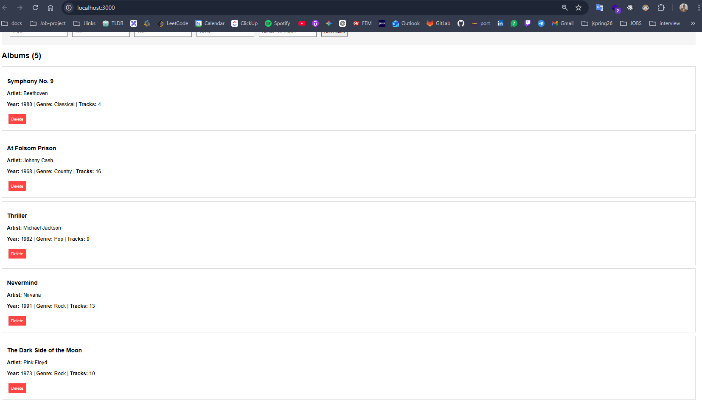
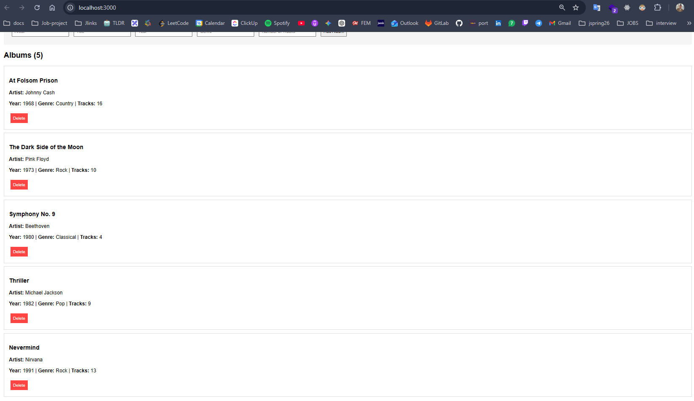
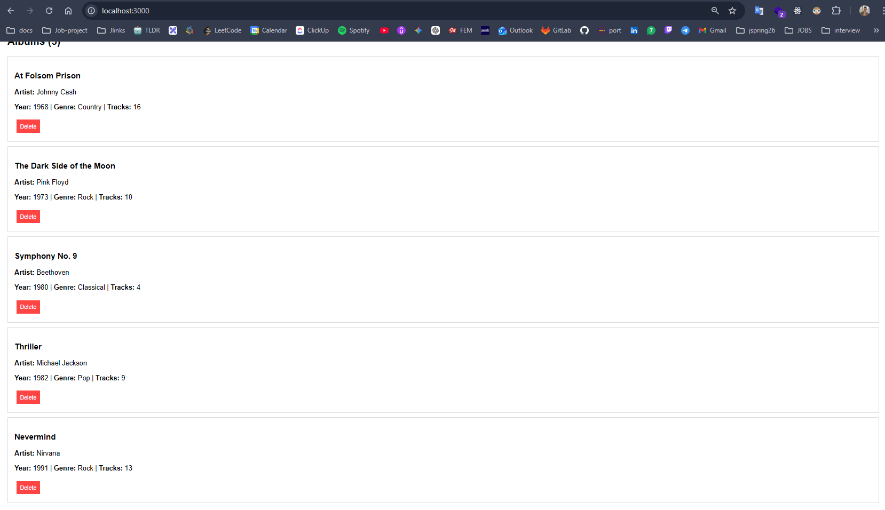
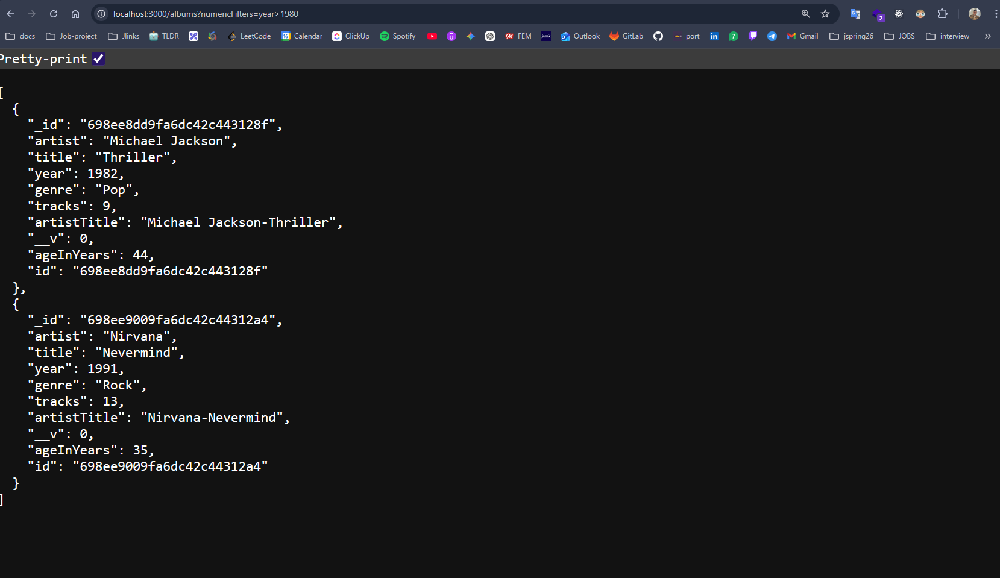
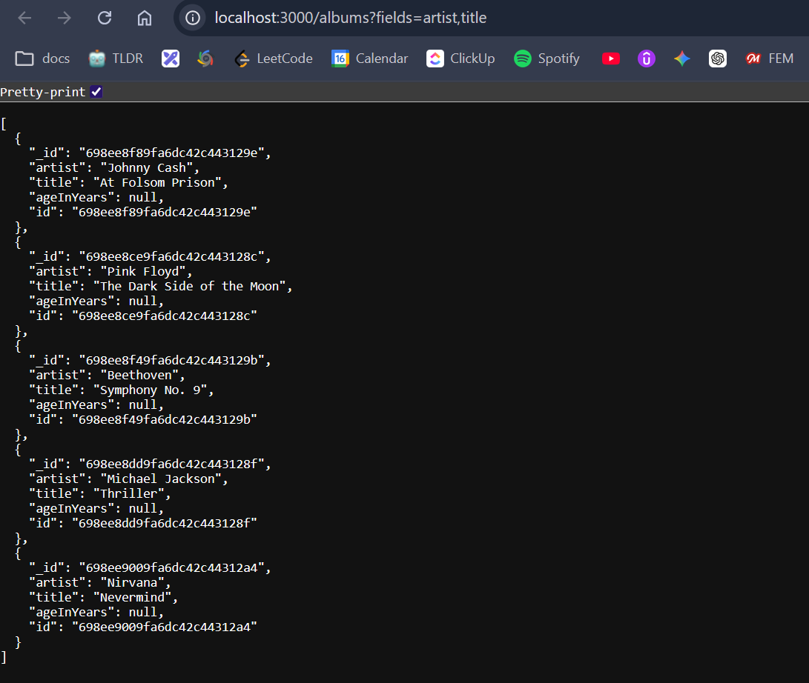
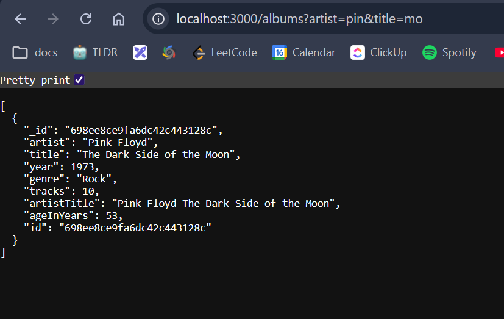
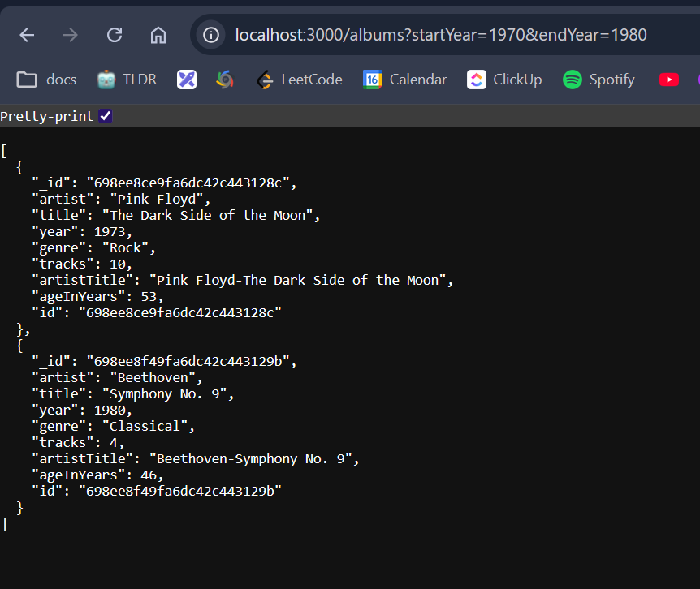
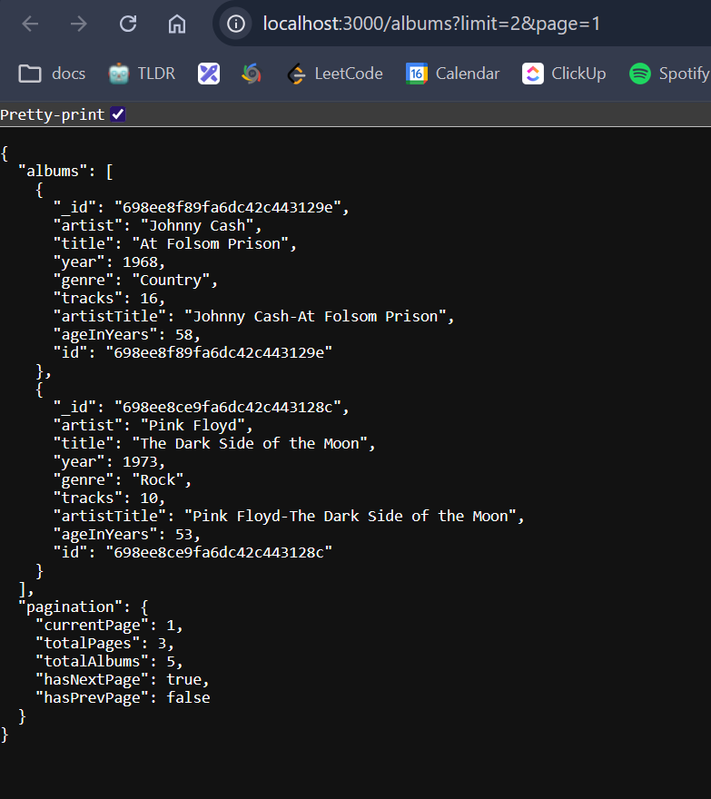

# Exercise set 05

## Task 1 - Sorting functionality [2p]

### Sorted by artist



### Sorted by artist



```js
export async function getAllAlbums(req, res) {
  // Implementation here

  try {
    const albumsSortedByYear = await Album.find({}).sort("artist");
    // const albums = await Album.find({}).sort("year");
    // const albums = await Album.find({}).sort("-year");
    res.json(albumsSortedByYear);
  } catch (error) {
    res.status(500).json({ error: "Failed To Load Album!" });
    console.error(error);
  }
}
```

## Task 2

### All Albums before Numeric filtering



### After sorted by Numeric filtering (Albums after 1980)



```js
export async function getAllAlbums(req, res) {
  const popAlbums = await Album.findByGenre("Pop");
  console.log(popAlbums);

  try {
    const queryObject = {};

    if (req.query.numericFilters) {
      const operatorMap = {
        ">": "$gt",
        ">=": "$gte",
        "=": "$eq",
        "<": "$lt",
        "<=": "$lte",
      };
      const regEx = /\b(>|>=|=|<|<=)\b/g;
      let filters = req.query.numericFilters.replace(regEx, (match) => `-${operatorMap[match]}-`);
      const options = ["year"];

      filters.split(",").forEach((item) => {
        const [field, operator, value] = item.split("-");
        if (options.includes(field)) {
          queryObject[field] = { [operator]: Number(value) };
        }
      });
    }

    let query = Album.find(queryObject);

    if (req.query.sort) {
      const sortList = req.query.sort.split(",").join(" ");
      query = query.sort(sortList);
    } else {
      query = query.sort("year");
    }

    const albums = await query;
    res.status(200).json(albums);
  } catch (error) {
    res.status(500).json({ error: "Failed To Load Album!" });
    console.error(error);
  }
}
```

# Task 3



```js
// part of albums.js
    let query = Album.find(queryObject);

    if (req.query.sort) {
      const sortList = req.query.sort.split(",").join(" ");
      query = query.sort(sortList);
    } else {
      query = query.sort("year");
    }

    if (req.query.fields) {
      const fieldsList = req.query.fields.split(",").join(" ");
      query = query.select(fieldsList);
    } else {
      // Optional default: hide __v
      query = query.select("-__v");
    }
```

# Task 4


```js
// In the getAllAlbums fucntion 
    const queryObject = {};

    // Task 4
    if(req.query.artist){
     queryObject.artist = { $regex: req.query.artist, $options: "i" };
    }

      if (req.query.title) {
      queryObject.title = { $regex: req.query.title, $options: "i" };
    }
```


# Task 5

### Custom Filtering: Albums released between 1970 and 1980


```js
// In the getAllAlbums function
    // Task 5 - Custom filtering: Filter between release years
    if (req.query.startYear || req.query.endYear) {
      queryObject.year = {}

      if (req.query.startYear) {
        queryObject.year.$gte = Number(req.query.startYear);
      }
      if (req.query.endYear) {
        queryObject.year.$lte = Number(req.query.endYear);
      }
    }
```


# Task 6



```js

    const page = Number(req.query.page) || 1;
    const limit = Number(req.query.limit) || 10;
    
    const skip = (page - 1) * limit;

    query = query.skip(skip).limit(limit);

    const albums = await query;

    const totalAlbums = await Album.countDocuments(queryObject);
    const totalPages = Math.ceil(totalAlbums / limit);

    res.status(200).json({
      albums,
      pagination: {
        currentPage: page,
        totalPages,
        totalAlbums,
        hasNextPage: page < totalPages,
        hasPrevPage: page > 1
      }
    });
```