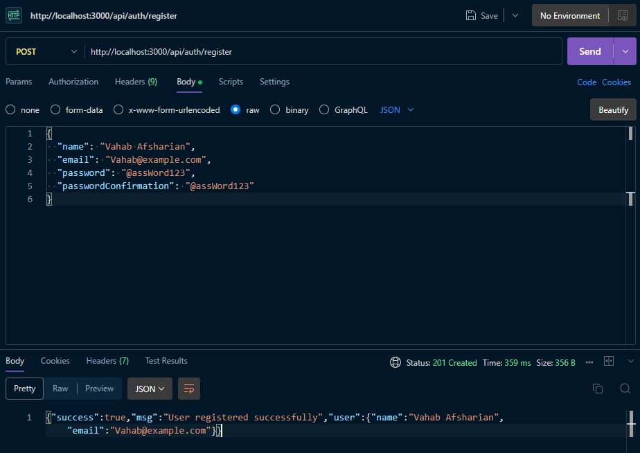
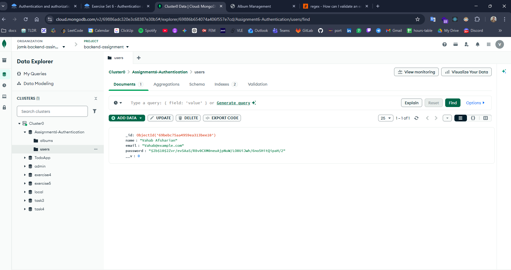
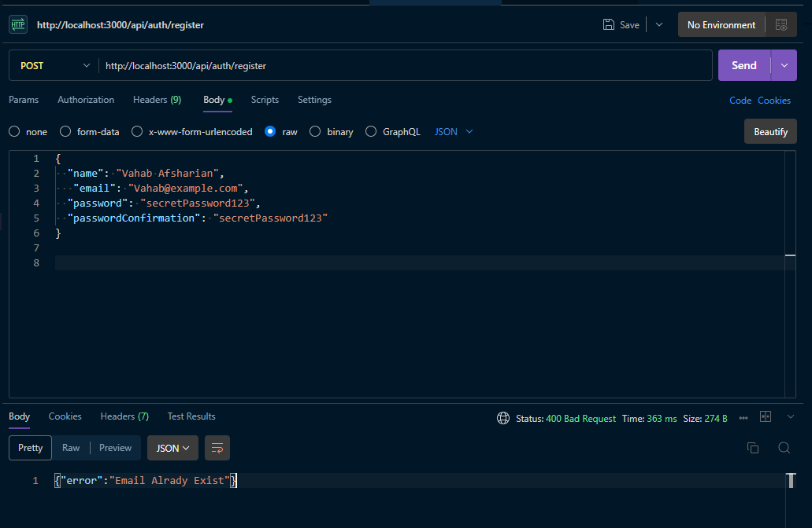
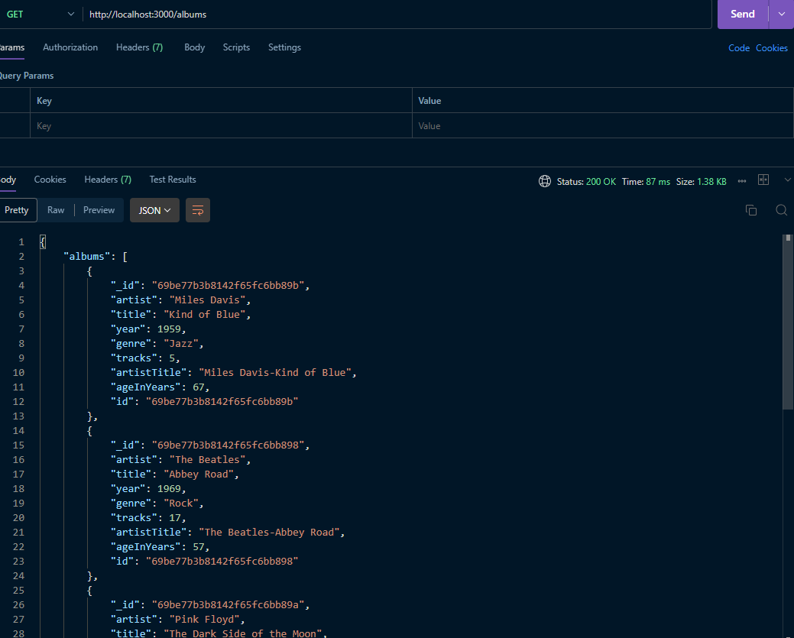
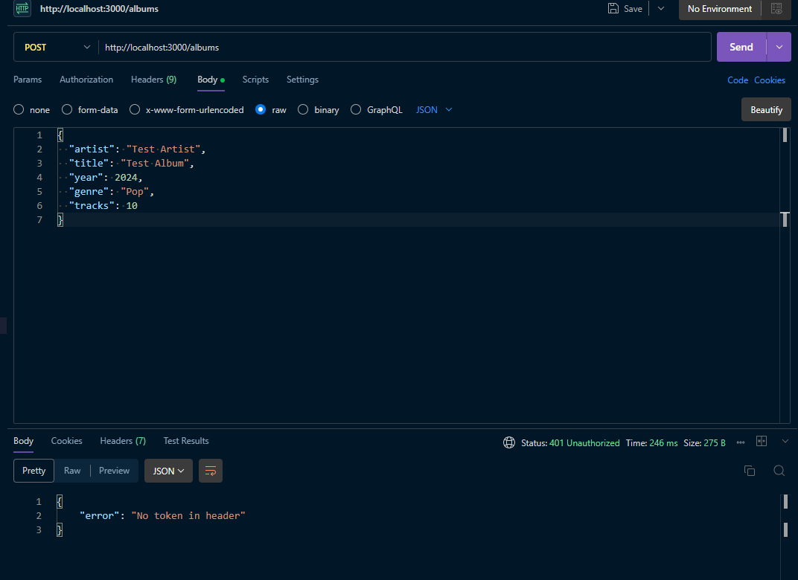
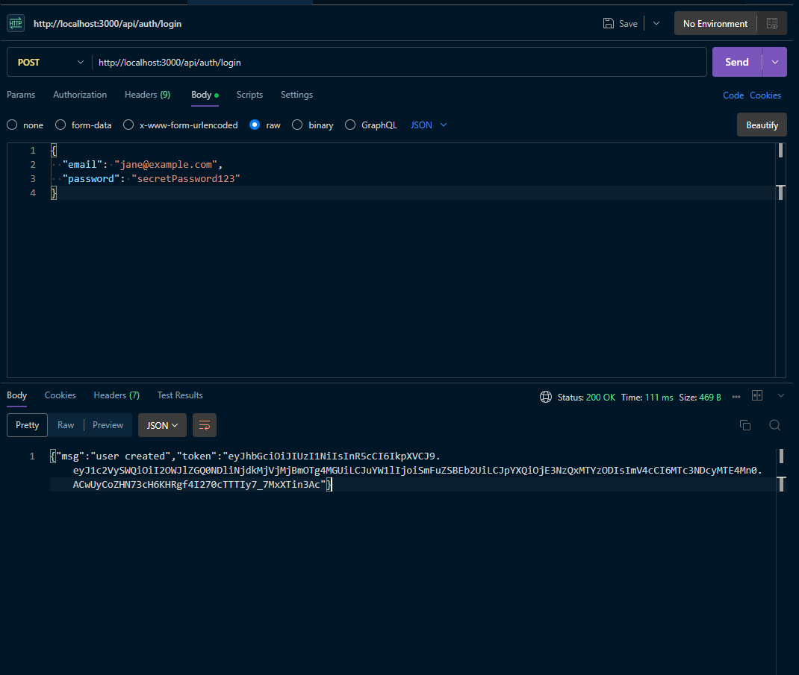
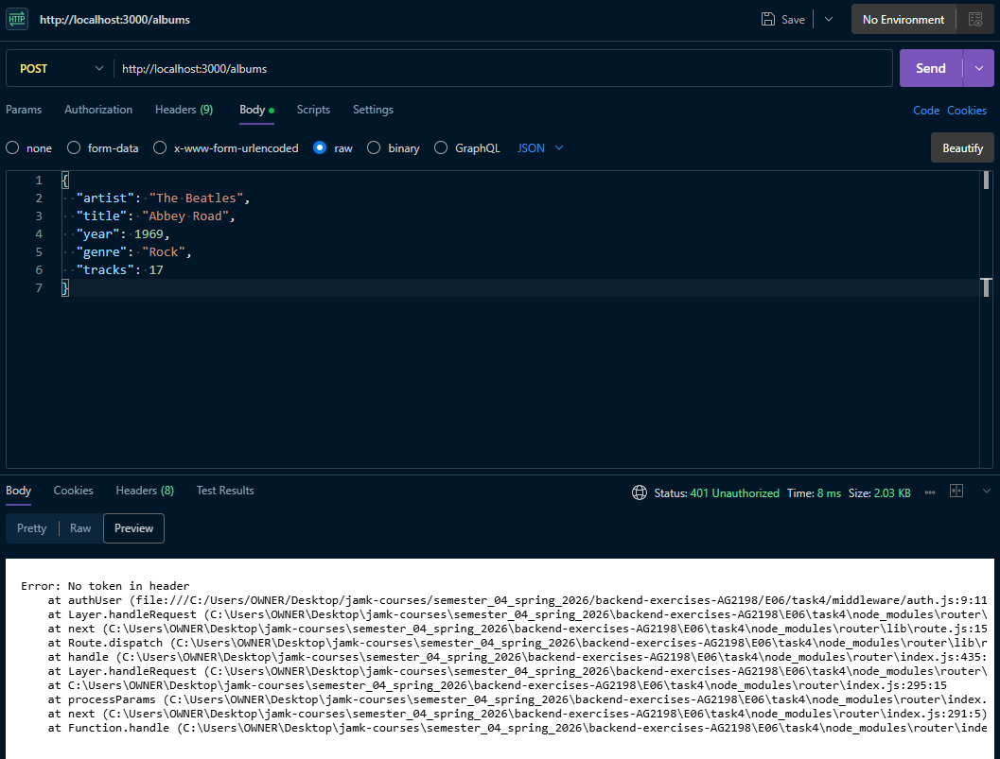

# Exercise set 06

## Task 1 - User registration with password hashing [4p]

```js
// models/User.js

import mongoose from "mongoose";
import bcrypt from "bcryptjs";

const userSchema = new mongoose.Schema({
  name: {
    type: String,
    required: [true, "Please provide a name"],
    minlength: 3,
    maxlength: 50,
  },

  email: {
    type: String,
    required: [true, "Please provide an email"],
    match: [
      /^(([^<>()[\]\\.,;:\s@"]+(\.[^<>()[\]\\.,;:\s@"]+)*)|(".+"))@((\[[0-9]{1,3}\.[0-9]{1,3}\.[0-9]{1,3}\.[0-9]{1,3}\])|(([a-zA-Z\-0-9]+\.)+[a-zA-Z]{2,}))$/,
      "Please provide a valid email",
    ],
    unique: true,
  },

  password: {
    type: String,
    required: [true, "Please provide a password"],
    minlength: 6,
  },
});

userSchema.pre("save", async function () {
  if (!this.isModified("password")) {
    return;
  }

  const salt = await bcrypt.genSalt(10);
  this.password = await bcrypt.hash(this.password, salt);
});

export default mongoose.model("User", userSchema);
```

```js
// controllers/auth.js
import User from "../models/User.js";

export const register = async (req, res) => {
  try {
    const { name, email, password, passwordConfirmation } = req.body;

    if (!name || !email || !password || !passwordConfirmation) {
      return res.status(400).json({ error: "All fields are required" });
    }

    if (password !== passwordConfirmation) {
      return res.status(400).json({ error: "Passwords do not match" });
    }

    const user = await User.create({ name, email, password });

    res.status(201).json({
      success: true,
      msg: "User registered successfully",
      user: { name: user.name, email: user.email },
    });
  } catch (error) {
    if (error.code === 11000) {
      return res.status(400).json({ error: "Email already exists" });
    }

    if (error.name === "ValidationError") {
      const messages = Object.values(error.errors).map((val) => val.message);
      return res.status(400).json({ error: messages.join(", ") });
    }

    console.error(error);
    res.status(500).json({ error: "Server Error" });
  }
};
```

```js
// routes/auth.js
import express from "express";
import { register } from "../controllers/auth.js";

const router = express.Router();

router.post("/register", register);

export default router;
```





## Task 2 - Duplicate email validation [3p]

```js
import User from "../models/User.js";

export const register = async (req, res) => {
  try {
    const { name, email, password, passwordConfirmation } = req.body;

    if (!name || !email || !password || !passwordConfirmation) {
      return res.status(400).json({ error: "All fields are required" });
    }

    if (password !== passwordConfirmation) {
      return res.status(400).json({ error: "Passwords do not match" });
    }

    // Assignment 6 - Task 2
    const existEmail = await User.findOne({ email: email });

    if (existEmail) {
      return res.status(400).json({ error: "Email Alrady Exist" });
    }

    const user = await User.create({ name, email, password });

    res.status(201).json({
      success: true,
      msg: "User registered successfully",
      user: { name: user.name, email: user.email },
    });
  } catch (error) {
    if (error.code === 11000) {
      return res.status(400).json({ error: "ERROR OCCURED!" });
    }

    if (error.name === "ValidationError") {
      const messages = Object.values(error.errors).map((val) => val.message);
      return res.status(400).json({ error: messages.join(", ") });
    }

    console.error(error);
    res.status(500).json({ error: "Server Error" });
  }
};
```



## Task 3 - JWT authentication and authorization [4p]

- First I install the JWT lib by

```js
npm install jsonwebtoken
```

- Then generate a token by:

```js
node
Welcome to Node.js v22.10.0.
Type ".help" for more information.
> require('crypto').randomBytes(64).toString('hex')
```

```js
// controllers/auth.js
export async function login(req, res) {
  try {
    const { email, password } = req.body;

    if (!email || !password) {
      return res.status(400).json({ error: "Provide both Email & Password" });
    }

    // Fetch user from DB
    const user = await User.findOne({ email: email });

    if (!user) {
      return res.status(400).json({ error: "Wrong Credential" });
    }

    // Check password, cuz was hashed in task 1
    const passwordIsMatch = await bcrypt.compare(password, user.password);

    if (!passwordIsMatch) {
      return res.status(401).json({ error: "Invalid credentials" });
    }

    const token = jwt.sign({ userId: user._id, name: user.name }, process.env.ACCESS_TOKEN_SECRET, { expiresIn: "7d" });

    res.status(200).json({ msg: "user created", token });
  } catch (err) {
    console.error(err);
    res.status(500).json({ error: "Server Error" });
  }
}
```

```js
// routes/auth.js
import express from "express";
import { login, register } from "../controllers/auth.js";

const router = express.Router();

router.post("/register", register);
// This new route is added
router.post("/login", login);

export default router;
```

```js
// middleware/auth.js
import jwt from "jsonwebtoken";

const authUser = async (req, res, next) => {
  const authHeader = req.headers.authorization;

  if (!authHeader || !authHeader.startsWith("Bearer")) {
    return res.status(401).json({ error: "No token in header" });
  }

  const token = authHeader.split(" ")[1];

  try {
    const decoded = jwt.verify(token, process.env.ACCESS_TOKEN_SECRET);

    const { id, name } = decoded;
    req.user = { id, name };

    next();
  } catch (error) {
    return res.status(401).json({ error: "Not authorized to access this route" });
  }
};

export default authUser;
```

```js
// routes/albums.js
import express from "express";
import authMiddleware from "../middleware/auth.js";

import { getAllAlbums, getAlbumById, createAlbum, updateAlbum, deleteAlbum } from "../controllers/albums.js";

const router = express.Router();

// Public routes, no need token to be viewd
router.get("/", getAllAlbums);
router.get("/:id", getAlbumById);

// PROTECTED routes (Token required to modify)
router.post("/", authMiddleware, createAlbum);
router.patch("/:id", authMiddleware, updateAlbum);
router.delete("/:id", authMiddleware, deleteAlbum);

export default router;
```

### To show albums can be fetched by anyone



### Starngers can not create an album as you see




## Task 4 - Custom error handling [4p]

```js
// errors/custom.js
class APIError extends Error {
  constructor(message, statusCode) {
    super(message);
    this.statusCode = statusCode;
  }
}

export { APIError };
```

```js
// errors/index.js
import { APIError } from "./custom.js";

class UnauthenticatedError extends APIError {
  constructor(message) {
    super(message, 401);
  }
}

class NotFoundError extends APIError {
  constructor(message) {
    super(message, 404);
  }
}

class BadRequestError extends APIError {
  constructor(message) {
    super(message, 400);
  }
}

export { APIError, UnauthenticatedError, NotFoundError, BadRequestError };
```

```js
// middleware/errorHandler.js
import { APIError } from "../errors/custom.js";

const errorHandlerMiddleware = (err, req, res, next) => {
  if (err instanceof APIError) {
    return res.status(err.statusCode).json({ error: err.message });
  }

  if (err.name === "ValidationError") {
    const messages = Object.values(err.errors).map((val) => val.message);
    return res.status(400).json({ error: messages.join(", ") });
  }

  if (err.code === 11000) {
    return res.status(400).json({ error: "Duplicate value entered" });
  }

  console.log(err);
  return res.status(500).json({ error: "Something went wrong, please try again" });
};

export default errorHandlerMiddleware;
```

```js
// middleware/auth.js
import jwt from "jsonwebtoken";
import { UnauthenticatedError } from "../errors/index.js";

const authUser = async (req, res, next) => {
  const authHeader = req.headers.authorization;

  if (!authHeader || !authHeader.startsWith("Bearer")) {
    throw new UnauthenticatedError("No token in header");
  }

  const token = authHeader.split(" ")[1];

  try {
    const decoded = jwt.verify(token, process.env.ACCESS_TOKEN_SECRET);

    const { userId, name } = decoded;
    req.user = { userId, name };

    next();
  } catch (error) {
    throw new UnauthenticatedError("Not authorized to access this route");
  }
};

export default authUser;
```


