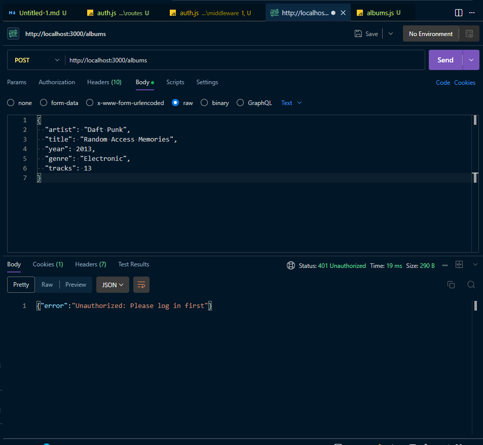
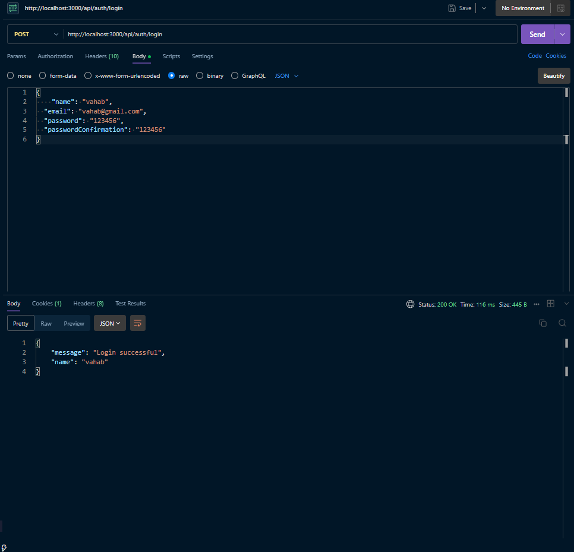
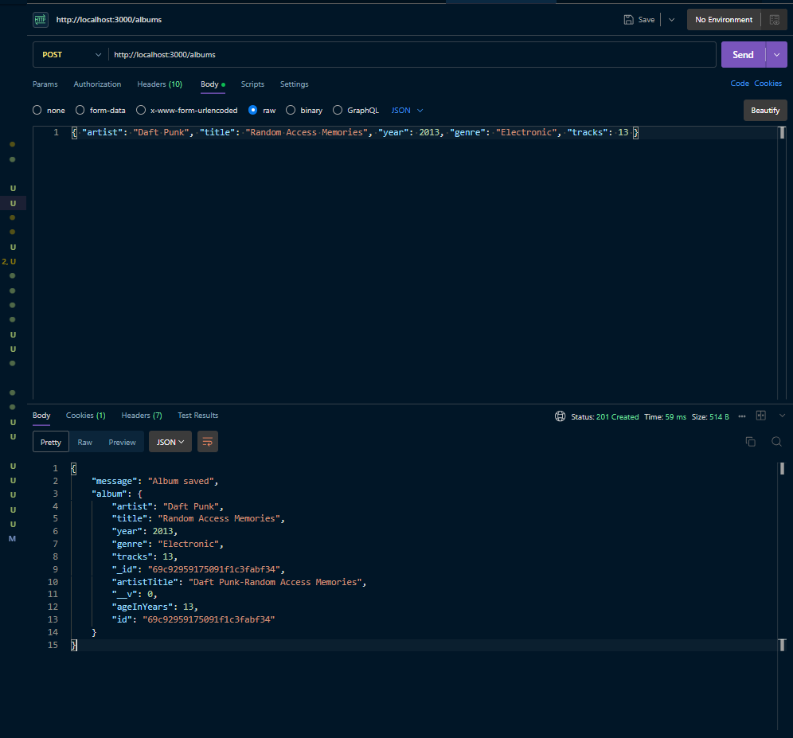
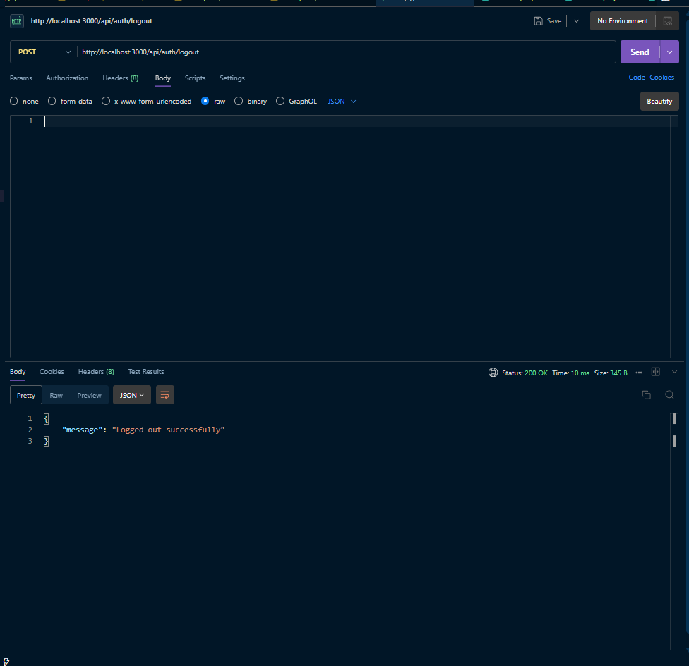

# Exercise set 07

## Task 1 - Session-based authentication [7p]

Install the express-session by

```bash
npm i express-session
```

Set up the session Middlware in the app.js

```js
import session from "express-session";

app.use(
  session({
    secret: "secret",
    resave: true,
    saveUninitialized: true,
    cookie: {
      maxAge: 24 * 60 * 60 * 1000,
      httpOnly: true,
    },
  }),
);
```

**`controllers/auth.js`**:

```js
export const login = async (req, res, next) => {
  // ... password validation logic ...

  // Create session
  req.session.userId = user._id.toString();
  req.session.name = user.name;

  res.status(200).json({ message: "Login successful", name: user.name });
};

export async function logout(req, res, next) {
  req.session.destroy((err) => {
    if (err) return next(err);
    res.clearCookie("connect.sid");
    res.status(200).json({ msg: "Logged out successfully" });
  });
}
```

- Adding login and logout to endpoint to create/remove the session

  **`routes/auth.js`**:

```js
import express from "express";
import { login, register, logout } from "../controllers/auth.js";

const router = express.Router();
router.post("/register", register);
router.post("/login", login);
router.post("/logout", logout);

export default router;
```

- Create the middlewaere fucntion

**`middleware/auth.js`**:

```js
export const requireAuth = (req, res, next) => {
  if (req.session && req.session.userId) {
    next();
  } else {
    res.status(401).json({ error: "Unauthorized: Please log in first" });
  }
};
```

- Finally appling this _requireAuth_ func for POST, PUT, and DELETE routes
  **`routes/albums.js`**:

```js
import { requireAuth } from "../middleware/auth.js";

// PUBLIC routes (Anyone can read)
router.get("/", albumController.getAllAlbums);
router.get("/:id", albumController.getAlbumById);

// PROTECTED routes (Require valid session)
router.post("/", requireAuth, albumController.createAlbum);
router.put("/:id", requireAuth, albumController.updateAlbum);
router.delete("/:id", requireAuth, albumController.deleteAlbum);
```






## Task 2 - User roles and authorization [8p]

Add documentation for the completion of Task 2 here.
