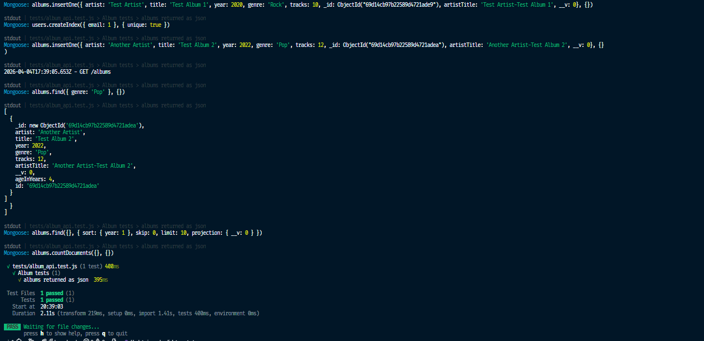
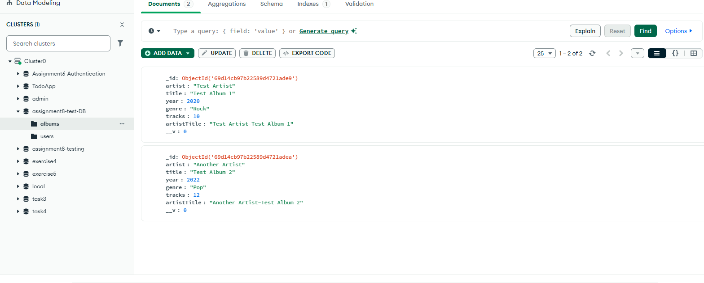
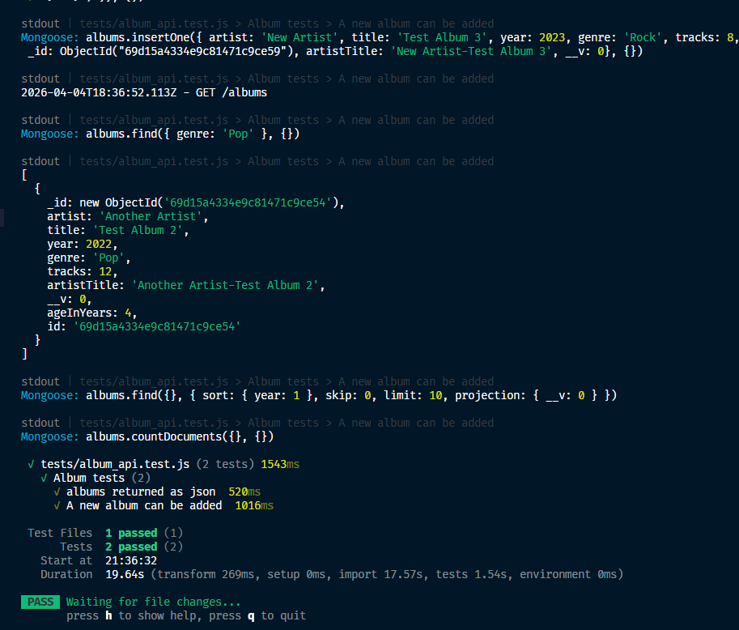
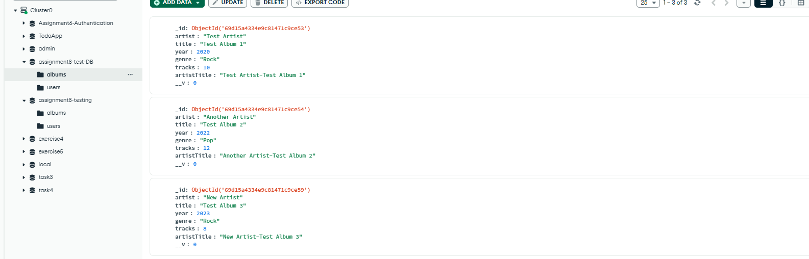
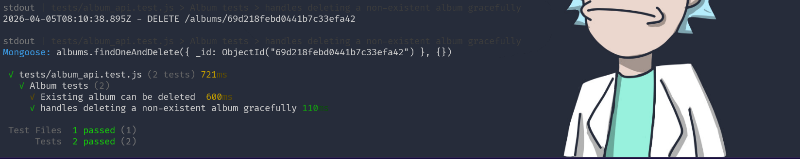

# Exercise set 08

## Task 1 - Test database setup and GET endpoint testing [3p]

Install testing dependencies:

```bash
npm install --save-dev vitest supertest
```

Then Added second database for testing, in the .env file:

```js
TEST_MONGO_URI = "mongodb+srv://lazybee....";
```

Then update the package.json

```json
  "scripts": {
    "start": "node app.js",
    "dev": "cross-env RUNTIME_ENV=development nodemon server.js",
    "test": "cross-env RUNTIME_ENV=test vitest"
  },
```

Create a Configuration File Create a new file utils/config.js

```js
import "dotenv/config";

const PORT = 3000;

const MONGODB_URI = process.env.RUNTIME_ENV === "test" ? process.env.TEST_MONGO_URI : process.env.MONGO_URI;

export { MONGODB_URI, PORT };
```

Update app.js

```js
import "dotenv/config";
import express from "express";
import albumRoutes from "./routes/albums.js";
import connectMongoDB from "./db/mongodb.js";
import authRoutes from "./routes/auth.js";
import errorHandlerMiddleware from "./middleware/errorHandler.js";
import { MONGODB_URI } from "./utils/config.js";

const app = express();

const requestLogger = (req, res, next) => {
  const timestamp = new Date().toISOString();
  console.log(`${timestamp} - ${req.method} ${req.url}`);
  next();
};

app.use(errorHandlerMiddleware);

app.use(requestLogger);
app.use(express.json());
app.use(express.static("public"));
app.use("/albums", albumRoutes);
app.use("/api/auth", authRoutes);

// const PORT = 3000;

// try {
//   await connectMongoDB(process.env.MONGO_URI);
//   app.listen(PORT, () => console.log(`Server listening on http://localhost:${PORT}`));
// } catch (error) {
//   console.log(error);
// }

await connectMongoDB(MONGODB_URI);

export default app;
```

Then created a server.js file in the root of the project

```js
import app from "./app.js";
import http from "http";
import { PORT } from "./utils/config.js";

const server = http.createServer(app);

server.listen(PORT, () => {
  console.log(`Server listening on http://localhost:${PORT}`);
});
```

### Testing

Create a folder named tests and add a file inside it called data.json

```js
[
  {
    title: "Test Album 1",
    artist: "Test Artist",
    year: 2020,
    genre: "Rock",
    tracks: 10,
  },
  {
    title: "Test Album 2",
    artist: "Another Artist",
    year: 2022,
    genre: "Pop",
    tracks: 12,
  },
];
```

Write my test in the tests/album_api.test.js

```js
import mongoose from "mongoose";
import supertest from "supertest";
import app from "../app.js";
import Album from "../models/Album.js";
import testAlbums from "./data.json";
import { describe, test, beforeEach, afterAll } from "vitest";

const api = supertest(app);

describe("Album tests", () => {
  beforeEach(async () => {
    await Album.deleteMany({});
    await Album.create(testAlbums);
  });

  test("albums returned as json", async () => {
    await api
      .get("/albums")
      .expect(200)
      .expect("Content-Type", /application\/json/);
  });

  afterAll(() => {
    mongoose.connection.close();
  });
});
```




## Task 2 - POST endpoint testing [4p]

For task 2 I just added another test in the tests/album_api.test.js

```js
import mongoose from "mongoose";
import supertest from "supertest";
import app from "../app.js";
import Album from "../models/Album.js";
import testAlbums from "./data.json";
import { describe, test, beforeEach, afterAll, expect } from "vitest";

const api = supertest(app);

describe("Album tests", () => {
  beforeEach(async () => {
    await Album.deleteMany({});
    await Album.create(testAlbums);
  });

  test("albums returned as json", async () => {
    await api
      .get("/albums")
      .expect(200)
      .expect("Content-Type", /application\/json/);
  });

  test("A new album can be added", async () => {
    const newAlbum = {
      title: "Test Album 3",
      artist: "New Artist",
      year: 2023,
      genre: "Rock",
      tracks: 8,
    };

    await api
      .post("/albums")
      .send(newAlbum)
      .expect(201)
      .expect("Content-Type", /application\/json/);

    const response = await api.get("/albums");
    expect(response.body.albums).toHaveLength(testAlbums.length + 1);
  });

  afterAll(() => {
    mongoose.connection.close();
  });
});
```




## Task 3 - DELETE endpoint testing [5p]

I just added 2 more tests to the tests/album_api.test.js file:

```js
test("Existing album can be deleted", async () => {
  const albumToDelete = await Album.findOne({});

  await api.delete(`/albums/${albumToDelete._id}`).expect(204);

  const response = await api.get("/albums");
  expect(response.body.albums).toHaveLength(testAlbums.length - 1);
});

test("handles deleting a non-existent album gracefully", async () => {
  const fakeId = new mongoose.Types.ObjectId();

  await api.delete(`/albums/${fakeId}`).expect(404);
});
```



## Task 4 - Application deployment [5p]
